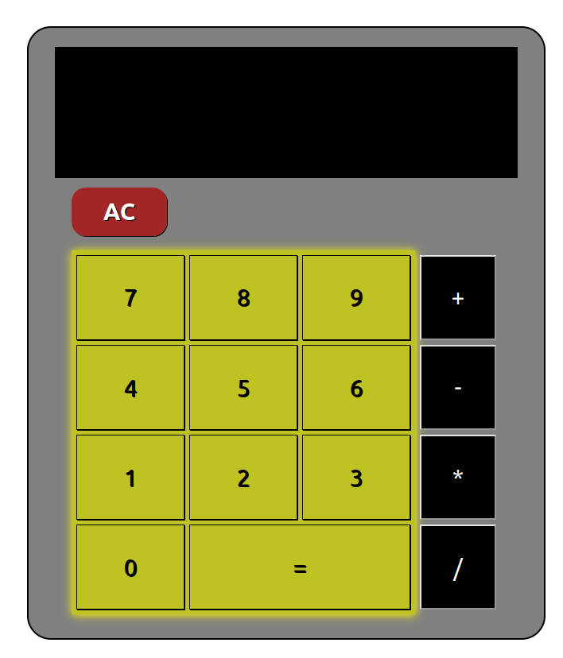

    <h1> JS Calculator 🖩  </h1>

    

    <ul>
        <li> HTML & CSS </li>
        <li> JS: Implementation using functions </li>
    </ul>

    

     
    
 This is the second project made for the Odin Project Curriculum - <b>a input & output based functioning calculator!</b> It uses very simple logic, with DOM interaction and calculation responsibilites separated by functions.
    
In this project, i learned and used for the first time:  

    <ul>
        <li> Function eval in JS </li>
        <li> Code separation using functions</li>
    </ul>
     
    
     
