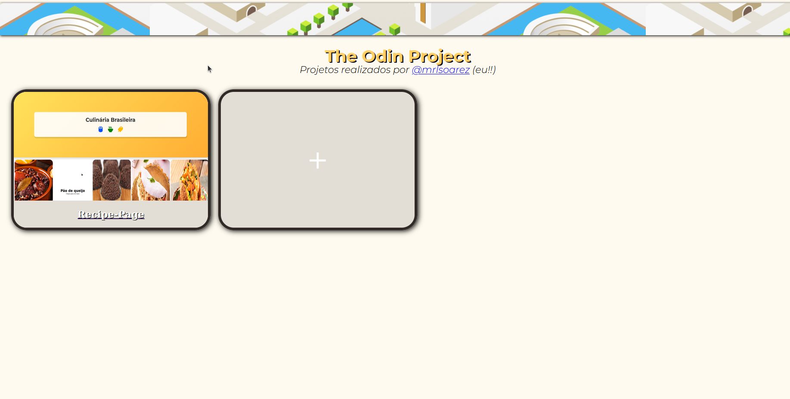

<h1>The Odin Project: Personal Projects 👽</h1>

Yello! Welcome to my personal project portfolio developed as part of The Odin Project. This webpage showcases various projects that I've completed, along with a brief overview and links to live demos.

<h2 id="overview">Overview</h2>

This made with the intent  to highlight my work through The Odin Project. It features each project with layed out with images and titles. 

<h2 id="technologies-used">Technologies Used</h2>
<ul>
    <li>HTML5</li>
    <li>CSS3</li>
    <li>JavaScript (if applicable)</li>
</ul>

<h2 id="projects">Projects</h2>

Available at.: <a href = "https://mrlsoarez.github.io/The-Odin-Project/">GitHub Pages</a>

