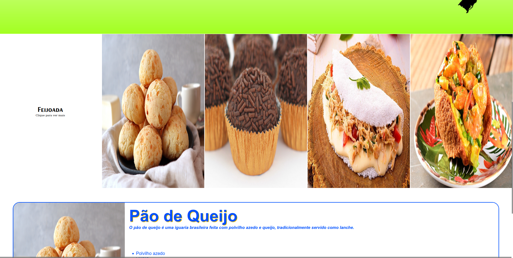

    <h1> Recipe's Landing Page 🥪 </h1>

    

    <ul>
        <li> HTML & CSS </li>
        <li> CSS animations </li>
        <li>Javascript for user interaction</li>
    </ul>

    

     
    
 This is the begginner's project made for the Odin Project Curriculum - a simple display of Recipes made with the essentials of a webpage - <strong> HTML </strong>, <strong> CSS! </strong> and JS!<strong></strong> From the get go, i wanted the project to be about Brazil's culinary to display a little of my culture.

    
In this project, i learned and used for the first time:  

    <ul>
        <li> CSS Events for interactive behavior</li>
        <li>JS dynamic display of elements</li>
    </ul>
     
    
     
