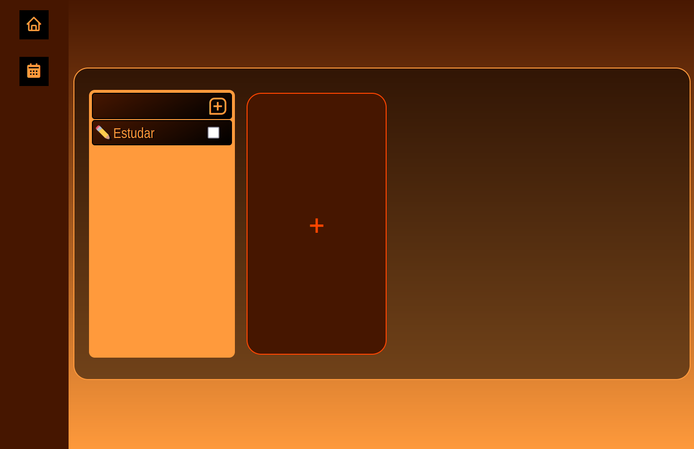

<h1>To-Do Project</h1>

<h2>Descrição</h2>

Este é um aplicativo de gerenciamento de tarefas "To-Do" que permite aos usuários criar projetos e adicionar tarefas a esses projetos. O aplicativo possui uma interface intuitiva, onde os usuários podem visualizar seus projetos, adicionar novas tarefas e navegar por um calendário.

<h2>Tecnologias Utilizadas</h2>
<ul>
    <li><strong>HTML</strong>: Para estruturação do conteúdo.</li>
    <li><strong>CSS</strong>: Para estilização do layout e design.</li>
    <li><strong>JavaScript</strong>: Para funcionalidades interativas e manipulação do DOM.</li>
    <li><strong>Boxicons</strong>: Para ícones e elementos gráficos.</li>
</ul>

<h2>Funcionalidades</h2>
<ul>
    <li><strong>Adicionar Projetos</strong>: Os usuários podem criar novos projetos através de um formulário que inclui:
        <ul>
            <li>Nome do projeto</li>
            <li>Data de conclusão</li>
            <li>Descrição</li>
            <li>Ícone representativo</li>
        </ul>
    </li>
    <li><strong>Gerenciar Tarefas</strong>: Cada projeto pode ter várias tarefas associadas a ele, permitindo que os usuários acompanhem seu progresso.</li>
    <li><strong>Navegação</strong>: O aplicativo possui uma navegação simples entre a visualização de projetos e um calendário.</li>
</ul>

