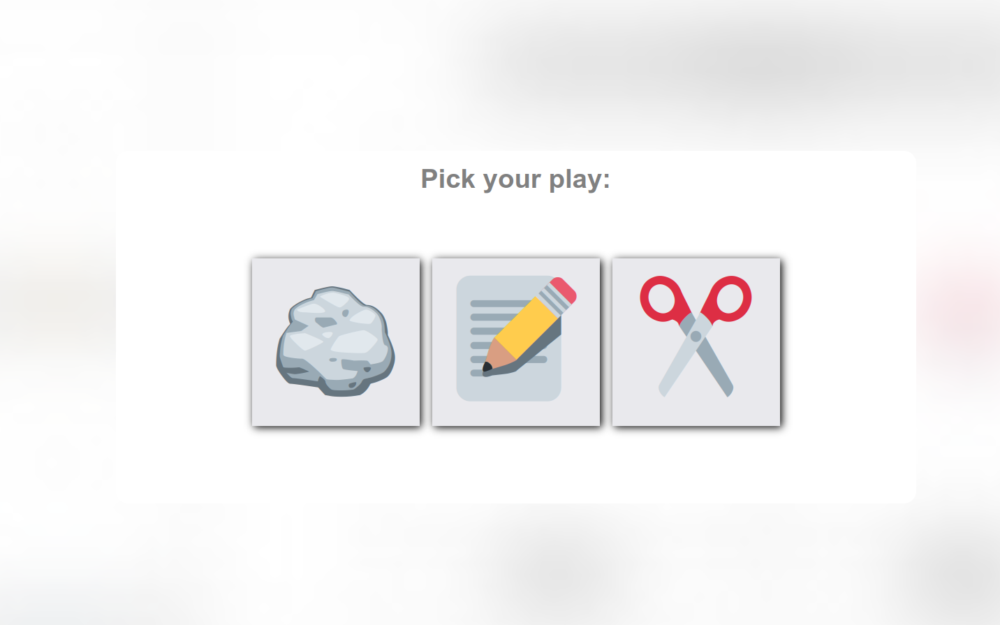

    <h1> Rock-Paper-Scissors Game ✂️📄🗿 </h1>

    <ul>
        <li> HTML & CSS </li>
        <li> CSS animations </li>
        <li> JavaScript for game logic and interaction </li>
    </ul>

 

 This is a beginner's project created as part of the Odin Project Curriculum - a simple Rock-Paper-Scissors game built with the fundamentals of a webpage - <strong> HTML </strong>, <strong> CSS! </strong> and <strong> JavaScript! </strong>

In this project, I learned and utilized for the first time:

<ul>
    <li> DOM manipulation for game interactions</li>
    <li> CSS animations to enhance user experience</li>
</ul>
 <a href="https://visionary-narwhal-13326e.netlify.app/">[Live Demo]</a>

 

